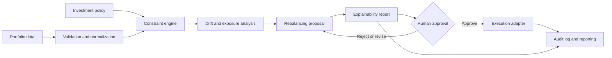

# SAFE Wealth Advisors

### Government Portfolio Rebalancer

<p align="center">
	<strong>A decision-support platform for transparent, policy-aware government portfolio rebalancing.</strong><br />
	Make allocation changes explainable, reviewable, and aligned with an institution's investment policy.
</p>

<p align="center">
	<a href="#quick-start">Quick Start</a> |
	<a href="#architecture--design-pattern">Architecture</a> |
	<a href="#usage--api-examples">API</a> |
	<a href="#contributing">Contributing</a>
</p>

<p align="center">
	
	
	
	
	
</p>

<p align="center">
	
</p>

> [!NOTE]
> The core API and deterministic rebalancing slice are now runnable. Lyzr integration, persistence, authentication, and production deployment remain planned work.

---

## Overview

Government investment teams need to rebalance portfolios without losing sight of policy constraints, liquidity needs, approval workflows, or the audit trail behind every decision. **SAFE Wealth Advisors** is the proposed foundation for that workflow: ingest a portfolio, evaluate drift against a target policy, generate constrained trades, and present a human-reviewable recommendation.

The source brief is preserved in [`safe_wealth_advisory_repository.pdf`](safe_wealth_advisory_repository.pdf). This README turns that brief into an implementation-oriented open-source contract.

### Core Features

| | Capability | Outcome |
| --- | --- | --- |
| :bar_chart: | **Portfolio health** | See current allocation, target allocation, drift, exposure, and liquidity in one review surface. |
| :shield: | **Policy constraints** | Keep recommendations within allocation bands, instrument rules, cash requirements, and mandate limits. |
| :arrows_counterclockwise: | **Rebalancing proposals** | Produce a ranked set of buy, sell, or hold actions with estimated post-trade allocation. |
| :mag: | **Explainable decisions** | Show the rule, input, threshold, and calculation behind each recommendation. |
| :clipboard: | **Approval workflow** | Separate draft, review, approval, execution, and rejection states. |
| :scroll: | **Auditability** | Preserve immutable inputs, recommendation versions, reviewer identity, and decision timestamps. |

## Architecture & Design Pattern

The planned system follows a **policy-first, human-in-the-loop pipeline**. Deterministic calculations remain separable from any optional optimization or AI-assisted explanation layer.



### Component Responsibilities

| Component | Responsibility | Design principle |
| --- | --- | --- |
| **Ingestion** | Accept and validate holdings, prices, cash, and policy inputs. | Reject ambiguous or incomplete data early. |
| **Normalization** | Convert source-specific records into a canonical portfolio model. | Keep adapters replaceable and deterministic. |
| **Constraint engine** | Evaluate policy bands, limits, exclusions, and liquidity rules. | A recommendation cannot bypass a hard constraint. |
| **Analytics** | Calculate weights, drift, exposure, turnover, and projected state. | Make calculations reproducible from stored inputs. |
| **Proposal engine** | Generate and rank candidate trades. | Separate optimization from approval authority. |
| **Review experience** | Present evidence, warnings, diffs, and approval actions. | Optimize for careful review, not blind automation. |
| **Audit and reporting** | Record all material inputs and state transitions. | Make every published recommendation traceable. |

## Tech Stack

The first implementation uses a small Python service with deterministic financial logic kept separate from optional AI assistance.

| Layer | Current decision | Selection criteria |
| --- | --- | --- |
| Language | Python 3.10+ | Strong numerical correctness, type safety, and maintainability. |
| Web application | `TBD` | Accessible, responsive review workflow with clear data density. |
| API | FastAPI | Versioned contract, validation, structured errors, and audit hooks. |
| Database | `TBD` | Transactional history, reproducible calculations, and secure access. |
| Infrastructure | `TBD` | Reproducible local development and least-privilege deployment. |
| Observability | `TBD` | Structured logs, health checks, metrics, and traceable run IDs. |

## Quick Start

The repository now contains a runnable API and deterministic engine. Persistence and a web client are still planned.

### Prerequisites

- Python `3.10+`
- `pip`
- A non-production portfolio fixture

Check the runtime versions:

```bash
python3 --version
python3 -m pip --version
```

### Install and Run

```bash
git clone https://github.com/mayankswaraj18cr-cmd/SAFE-wealth-advisors-government-portfolio-rebalancer-AI-QUEST-.git
cd SAFE-wealth-advisors-government-portfolio-rebalancer-AI-QUEST-

cp .env.example .env
python3 -m venv .venv
. .venv/bin/activate
python -m pip install -r requirements.txt
uvicorn main:app --reload
```

> [!WARNING]
> Do not use real personally identifiable, account, or fiduciary data during local development. Use synthetic fixtures until access control, encryption, retention, and audit requirements have been implemented and reviewed.

### `.env.example` Contract

The repository includes a redacted `.env.example`. Never commit credentials or production connection strings.

```dotenv
ENVIRONMENT=development
AIMS_ENDPOINT=
LYZR_API_KEY=
MIN_CASH_BUFFER_PCT=0.05
TRADE_THRESHOLD_USD=500
```

## Usage & API Examples

The API is implemented as a synchronous, review-only proposal endpoint. It never executes trades.

### Request a Rebalance Proposal

```bash
curl --request POST \
		--url http://localhost:8000/api/v1/rebalance \
	--header 'content-type: application/json' \
	--data '{
		"ips": {"client_id": "demo-government-fund", "risk_score": 5, "time_horizon_years": 10, "liquidity_needs_usd": 10000, "tax_bracket_pct": 24},
		"portfolio": {
			"client_id": "demo-government-fund",
			"holdings": [
				{"symbol": "EXAMPLE-EQUITY", "asset_class": "Equity", "shares": 4200000, "current_price": 1, "cost_basis": 1},
				{"symbol": "EXAMPLE-BOND", "asset_class": "Fixed Income", "shares": 5300000, "current_price": 1, "cost_basis": 1},
				{"symbol": "CASH", "asset_class": "Cash", "shares": 500000, "current_price": 1, "cost_basis": 1}
			]
		}
	}'
```

### Proposed Response

```json
{
	"client_id": "demo-government-fund",
	"target_allocations": {"Equity": 0.60, "Fixed Income": 0.30, "Commodity": 0.05, "Cash": 0.05},
	"orders": [
		{
			"symbol": "EXAMPLE-EQUITY",
			"action": "SELL",
			"shares": 420000,
			"estimated_price": 1,
			"tax_impact_usd": 0,
			"reasoning": "Move Equity toward 60% policy target"
		}
	],
	"compliance_approved": true,
	"violations": [],
	"audit_id": "SEC-AUDIT-01JEXAMPLE"
}
```

## Environment Variables Reference

| Variable | Type | Default | Description |
| --- | --- | --- | --- |
| `ENVIRONMENT` | string | `development` | Runtime environment name. |
| `AIMS_ENDPOINT` | URL | unset | Optional remote audit endpoint; local JSONL logging is used when unset. |
| `LYZR_API_KEY` | secret | unset | Optional key for the Lyzr agent integration. |
| `MIN_CASH_BUFFER_PCT` | decimal | `0.05` | Minimum cash reserve as a fraction of market value. |
| `TRADE_THRESHOLD_USD` | decimal | `500` | Minimum absolute trade value to generate an order. |

## Testing & Quality Assurance

Run the current test suite and coverage checks with:

```bash
# Unit tests: calculations, validation, and policy constraints
python -m pytest -q

# Integration tests: persistence, API, and workflow transitions
python -m pytest tests/test_api.py -q

# Coverage report and threshold enforcement
python -m pytest --cov=. --cov-report=term-missing
```

At minimum, the test suite should cover boundary conditions for allocation bands, rounding and currency precision, missing prices, cash minimums, repeated approvals, rejected proposals, and deterministic replays.

<details>
<summary><b>Quality checklist for the first release</b></summary>

- [ ] Validate every external input at the API boundary.
- [ ] Use decimal-safe arithmetic for monetary calculations.
- [ ] Keep hard policy constraints independent from explanatory text generation.
- [ ] Add authorization checks to every portfolio and approval operation.
- [ ] Record calculation inputs, version, and output hash for reproducibility.
- [ ] Run dependency, secret, and static analysis checks in CI.

</details>

## Roadmap

- [x] Establish project brief and product direction.
- [x] Define a policy-first rebalancing flow.
- [x] Select and document the implementation stack.
- [x] Add canonical portfolio and policy schemas.
- [x] Implement deterministic drift and constraint calculations.
- [x] Add a reviewable recommendation workflow.
- [ ] Add persistence, authorization, and audit history.
- [ ] Publish deployment, security, and operations documentation.

## Contributing

Contributions are welcome once the implementation begins. Keep changes small, explain domain assumptions, and include tests for behavior that affects allocation, policy, money, or approval state.

```text
Branch:  feature/<short-description>
Commit:  type(scope): imperative summary
Example: feat(analysis): add allocation-band drift calculation
```

Before opening a pull request:

1. Run the relevant unit and integration suites.
2. Explain the policy or data-model impact in the PR description.
3. Include migration, configuration, and security implications.
4. Keep generated artifacts and secrets out of the commit.
5. Request review from someone familiar with both the code and the investment domain.

## License & Acknowledgments

The repository does not currently contain a license file. Until the maintainers publish one, **all rights are reserved** and reuse should not be assumed. The project should add a formal `LICENSE` file and replace this notice with its exact SPDX identifier before accepting external code contributions.

Suggested metadata for the eventual release:

```text
SPDX-License-Identifier: LicenseRef-Project-Pending
Copyright (c) 2026 project contributors
```

Acknowledgments:

- The requirements and product direction are captured in [`safe_wealth_advisory_repository.pdf`](safe_wealth_advisory_repository.pdf).
- Third-party dependencies, data providers, and design inspirations will be credited here as they are selected.

---

<p align="center">
	Built for careful decisions, transparent review, and accountable public finance.
</p>